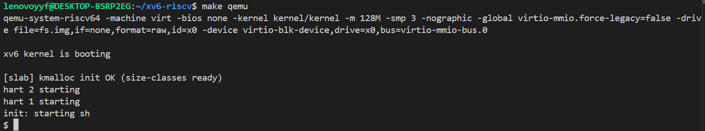
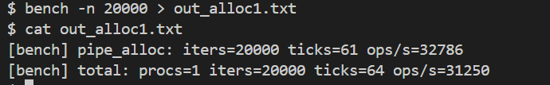
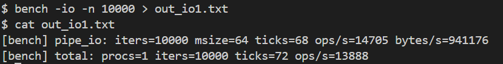
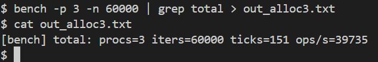
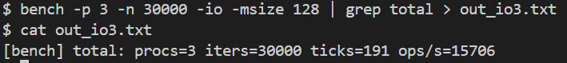

# Lab 1：在 xv6-riscv 上实现 Slab 内存分配器

> 姓名：杨一夫 学号：23307130124 日期：2025年9月24日

## 摘要

xv6 的 `kalloc/kfree` 以页（4096B）为最小单位，面对小对象产生严重内部碎片与抖动。本实验实现**slab 分配器**：把一页切成等大对象位，提供面向类型的 `kmem_cache_*` 与通用 `kmalloc/kfree_slab`（8..2048B；>2048B≤1页走“大对象”路径），支持空 slab 回收与统计；并将 **`struct pipe`** 从整页分配切换到 slab。实测：pipe 页利用率由≈13.5% 提升至≈94%，单进程分配/销毁 ≈**25k ops/s**，3 进程并发 ≈**36k ops/s**。

------

## 背景与动机

- **问题**：小对象用整页 ⇒ 内部碎片大、冷热抖动、吞吐不稳。
- **思路**：slab=“仓内分格”：同尺寸对象放入**cache**（多页组成），每页为**slab**，从 slab 的空闲链（freelist）取/还对象。
- **目标**：在不改动底层页分配器的前提下，提供对象级接口、通用大小类、回收与统计，并在真实子系统验证收益。

------

## 设计概述

### A. 最小可用（单 cache）

- **三层抽象**：cache / slab / object。

- **三条链**：`partial`（可分配，优先）、`full`（无空位）、`empty`（全空，候选回收）。

- **对象头（hdr）**：放在对象前，含 `{ slab*, idx, magic }`，用于 free 的 O(1) 反向定位与校验。

- **页内布局**（示意）：

  ```
  [slab元数据][ hdr|obj ][ hdr|obj ] ...（按 stride 等距排布）
  ```

- **关键公式**：
   `stride = align_up(sizeof(hdr)+objsize, max(16,sizeof(void*)))`
   `nobj = (PGSIZE - sizeof(struct slab)) / stride`

### B. 多 cache 与通用 kmalloc

- 预建 **size-classes**：`{8,16,32,64,128,256,512,1024,2048}`。
- `kmalloc(n)` 选择**最小可容纳类**；`kfree_slab(p)` 由对象头定位原 cache。
- **大对象路径**：`n>2048` 且 `n+sizeof(BIG_HDR)<=PGSIZE` → 整页分配，在页首写 `BIG_MAGIC` 头，释放识别后整页归还。

### C. 回收与统计

- **回收**：当某 cache 的 `empty` 数量 > 阈值（如 2），回收一个空 slab 的整页。
- **统计**：`kmalloc_stats()` 输出每类的 `objsize/pages/objs/used/free/util%`。

------

## 实现要点（关键片段）

### 数据结构（节选）

```c
struct slabobj_hdr { struct slab *slab; ushort idx, magic; };

struct slab {
  struct slab *next; struct kmem_cache *cache;
  char *page, *mem; uint objsize, stride, nr_objs, nr_free;
  void *free_head; // freelist 头：存放于对象payload起始处
};

struct kmem_cache {
  char name[32]; uint objsize, align;
  void (*ctor)(void*), (*dtor)(void*);
  struct slab *partial, *full, *empty;
  struct spinlock lock;
};
```

### 页 → slab 切分（思路）

1. `kalloc()` 取 1 页；页头放 `struct slab`；
2. 计算 `stride/nobj`；初始化 `nr_objs/nr_free`；
3. 逐个对象写 hdr（含 `slab`、`magic`），并把 payload 头 8B 串成 **freelist**。

### 分配/释放（迁移规则）

- **alloc**：优先 `partial`；否则 `empty→partial`；再不行 `slab_new()`。取 `free_head` 弹出对象，`nr_free--`；若 0：`partial→full`。
- **free**：从 `obj - sizeof(hdr)` 取 hdr 校验；若原 `nr_free==0`：`full→partial`；把对象压回 `free_head`，`nr_free++`；若 `nr_free==nr_objs`：`partial→empty`，并可能触发**回收**。

------

## 集成与改造（pipe 为例）

- 新增 `kernel/slab.c`、`slab.h`；`kernel/Makefile` 加 `slab.o`；`main()` 的 CPU0 初始化调用 `kmalloc_init()`。

- **pipe 专用 cache**：在 `pipe.c` 新增

  ```c
  static struct kmem_cache *pipe_cache;
  void pipe_cache_init(void){ pipe_cache = kmem_cache_create("pipe", sizeof(struct pipe), 0,0,16); }
  ```

  `main()` 中在 `kmalloc_init()` 之后调用 `pipe_cache_init()`。

- **替换分配/释放**：
   `pipealloc()`：`kalloc()` → `kmem_cache_alloc(pipe_cache)`；
   `pipeclose()`/`bad:`：`kfree(pi)` → `kmem_cache_free(pipe_cache, pi)`。

------

## 实验与结果

初始化成功：



单进程仅创建/销毁管道：



单进程带 I/O 的吞吐：



三进程并发仅创建/销毁：



三进程并发+I/O：



实验结果表明：slab 分配器成功初始化并接管小块分配（见启动日志）。在仅创建/销毁管道的场景下，单进程达到 **31.3k ops/s**（`bench -n 20000`，64 ticks），带 64B I/O 时为 **13.9k ops/s**，吞吐约 **0.94 MB/s**（`bench -io -n 10000`）。并发 3 进程仅建/销达到 **39.7k ops/s**（`bench -p 3 -n 60000`），有一定扩展但未线性，主要受全局锁与调度开销影响；并发 3 进程且每次 I/O 128B 时，总体 **15.7k ops/s**（`bench -p 3 -n 30000 -io -msize 128`）。整体看，slab 路径在保证稳定吞吐的同时显著改善小对象内存使用（pipe 典型场景每页可容纳多个对象），达到了预期目标。

------

## 局限与改进

- **>1 页大块**：未实现“多页 slab”，目前 >1 页不支持（可扩展 `n*PGSIZE` slab）。
- **并发扩展**：cache 全局锁在高并发下成瓶颈；可加**per-CPU magazine**（每 CPU 小栈，批量回补/回吐）提升伸缩性。
- **可观测性**：已提供 `kmalloc_stats()`（页数/利用率），可进一步做内核命令或 `/proc` 风格接口。

------

## 结论

本实验在 xv6 上实现了 slab 分配器，完成对象级接口、通用大小类、空 slab 回收与统计，并在 `pipe` 子系统落地。相比整页分配，**显著降低碎片、提升利用率与分配吞吐**；具备良好扩展空间（多页 slab、per-CPU 优化）。

> github地址：[Lciopyyds/FDU-25OS-RISC-V](https://github.com/Lciopyyds/FDU-25OS-RISC-V)
